# VEXO

App de fretes que conecta motoristas e clientes, com agendamento, rastreamento em tempo real e chat integrado.

## Protótipo no Figma
[Ver protótipo completo](https://www.figma.com/design/bLbZSOqiDqZxzK5Bm23Wim/VEXO?node-id=115-5&t=NcCAm5mMovT8KJz3-1)

## Telas principais

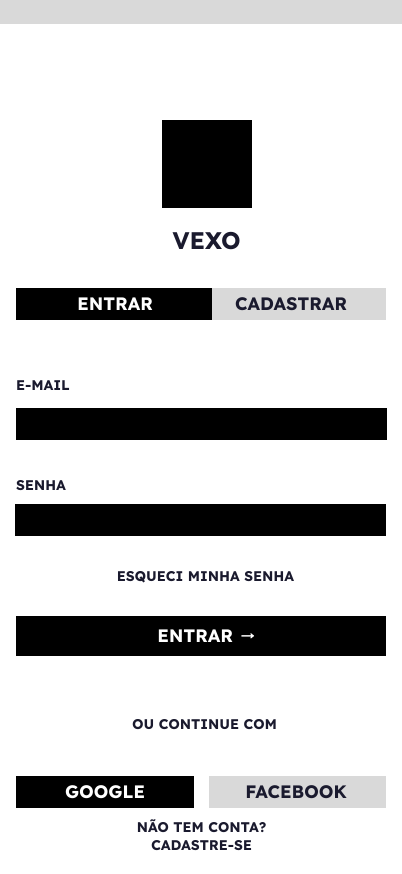
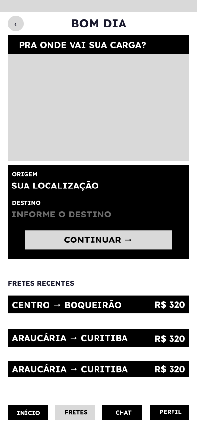
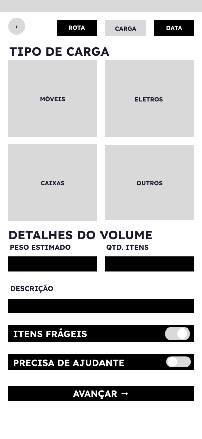
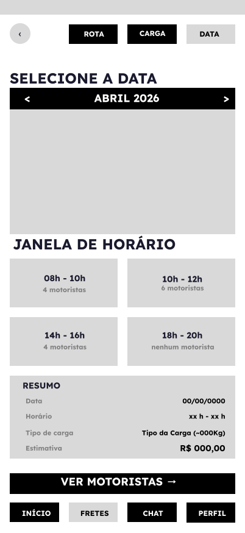
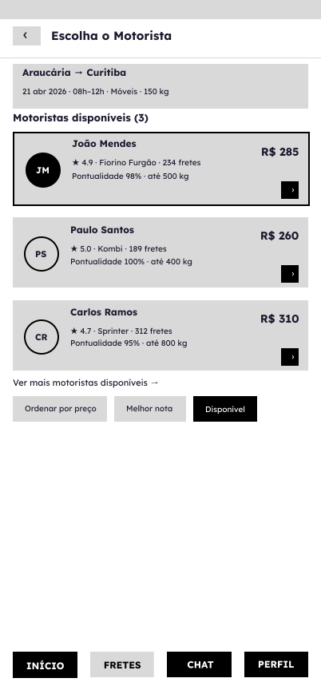
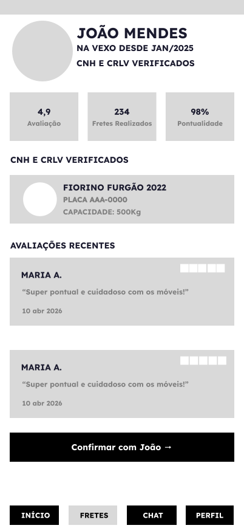
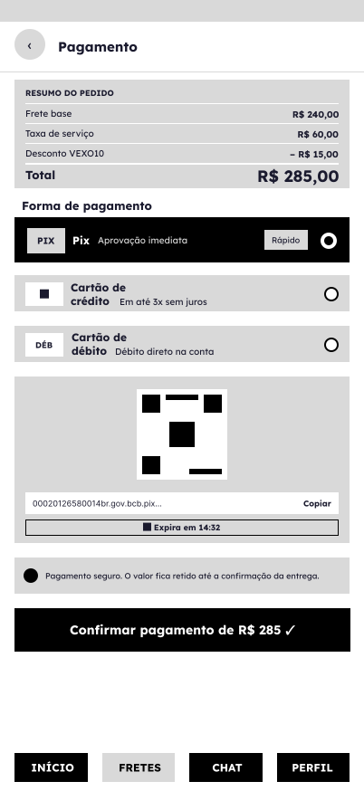
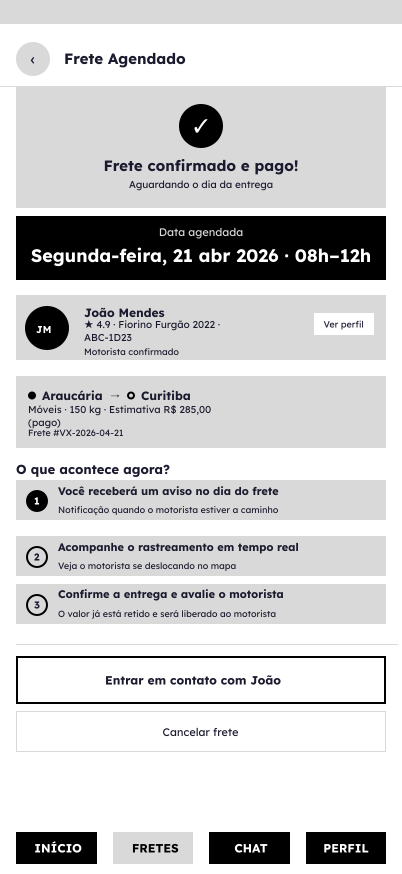
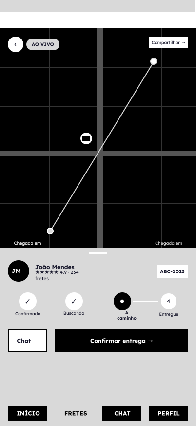
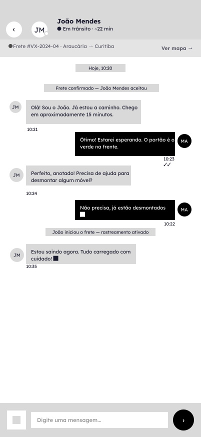
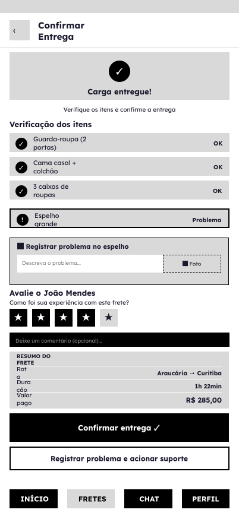
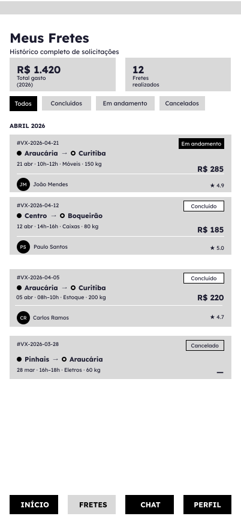

## Design System
Paleta de cores, tipografia, ícones e demais componentes visuais estão na pasta [`design-system`](design-system).

## Protótipo navegável
Capturas de tela do fluxo interativo estão na pasta [`prototipo`](prototipo).
